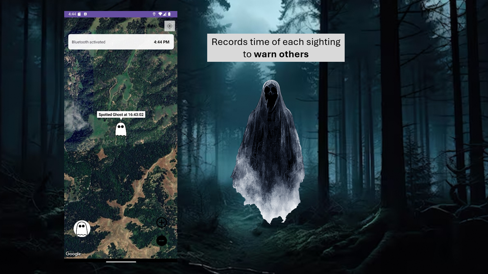
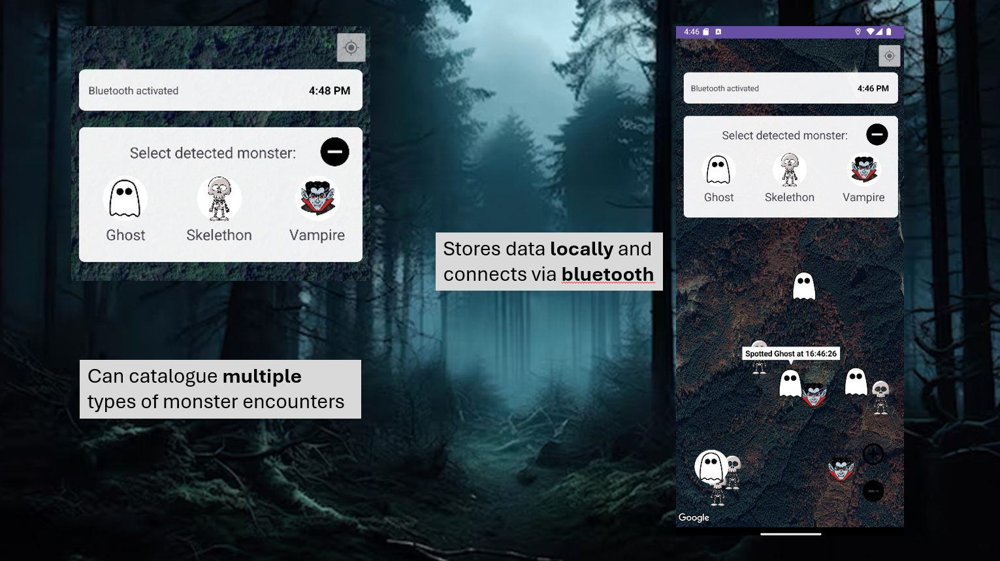
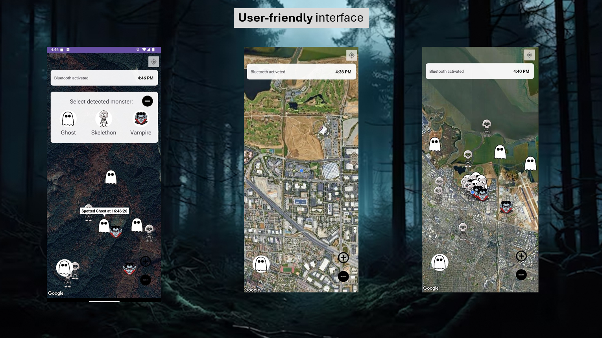

# 👻 SpecterSpot

**Event:** ITFest Adobe Hackathon – October 2024
---
**Developed by:** DavTheUtz Team | Theodor Vulpe, Ioan-Daniel Tudorescu, Bogdan-Marian Zamfiroiu, David-Mihai Petreus

---

## 🧩 Overview

**SpecterSpot** is a mobile Android application built around a fictional horror scenario:  
A group of friends is partying in the middle of the forest when things take a turn for the worse. Strange and spooky events begin to unfold — ghostly apparitions, skeletons, and vampires start appearing. To stay safe and alert others, users can report these supernatural sightings in real-time.

The app provides an **interactive map** that allows users to pin and view sightings based on their **current location**. Each report includes a **timestamp**, enabling others to know not just where, but also **when** an encounter was reported.

---

## 🚀 Features

- 🗺️ **Live Interactive Map**  
  Integrates the **Google Maps SDK for Android** to display reports in real-time.

- 👁️ **Quick Report System**  
  A pop-up menu allows users to select one of three creature types:
  - 👻 Ghost  
  - 💀 Skeleton  
  - 🧛 Vampire

- 🕒 **Time-Based Entries**  
  Each report is timestamped, letting users track how recent a sighting was.

- ⚠️ **Community Awareness**  
  Helps users stay safe by avoiding areas with recent paranormal activity.

---

## 📷 Screenshots

---

## 🛠️ Tech Stack

- **Platform:** Android  
- **Language:** Java  
- **IDE:** Android Studio  
- **Map Integration:** Google Maps SDK for Android
